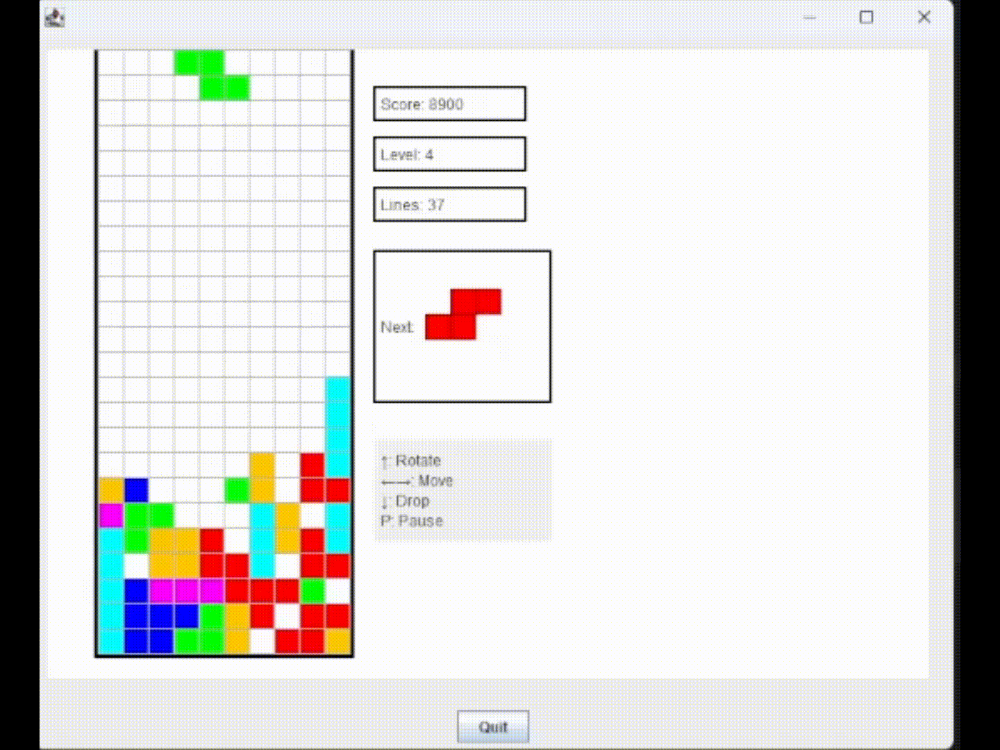

# 🎮 Java Tetris

A fully functional Tetris game created as a school project for Object-Oriented Design. Built in Java using the **WheelsUNH** graphics library. Features all 7 standard Tetromino pieces, line clearing with scoring, level progression, piece preview, and a multithreaded game loop.

---

## 📸 Preview



---

## ✨ Features

- All 7 classic Tetromino pieces (I, O, T, S, Z, J, L)
- Piece rotation with wall-aware collision detection
- Line clearing with standard Tetris scoring (100 / 300 / 500 / 800 points)
- Level progression every 10 lines — speed increases with level
- Next-piece preview panel
- Pause / resume support
- Game over detection
- Multithreaded game loop for smooth, responsive input
- Custom exception handling (`GameException`, `InvalidMoveException`)
- Generic `GameStateManager<T>` for score history tracking

---

## 📦 Dependencies

### WheelsUNH Library

This project uses **WheelsUNH**, a Java graphics library originally developed at the University of New Hampshire for introductory CS courses. It provides the `Frame`, `Rectangle`, and `ShapeGroup` classes used throughout the project.

> ⚠️ The project will **not compile or run** without this library.

You can find `wheelsunh.jar` in the `/lib` folder of this repository.

---

## 🚀 Getting Started

### Prerequisites

- [Java JDK 8 or higher](https://www.oracle.com/java/technologies/downloads/) installed
- `wheelsunh.jar` on your classpath (see below)

### 1. Clone the repository

```bash
git clone https://github.com/YOUR_USERNAME/YOUR_REPO_NAME.git
cd YOUR_REPO_NAME
```

### 2. Add the WheelsUNH library

**IntelliJ IDEA**
1. Go to **File → Project Structure** (`Ctrl+Alt+Shift+S`)
2. Select **Modules → Dependencies**
3. Click **+** → **JARs or Directories** → select `wheelsunh.jar`
4. Click **OK** and **Apply**

**Eclipse**
1. Right-click the project → **Build Path → Configure Build Path**
2. Go to the **Libraries** tab → **Add External JARs**
3. Select `wheelsunh.jar` → **Apply and Close**

**VS Code**
1. Install the [Extension Pack for Java](https://marketplace.visualstudio.com/items?itemName=vscjava.vscode-java-pack)
2. Open the Command Palette (`Ctrl+Shift+P`) → **Java: Configure Classpath**
3. Under **Referenced Libraries**, click **+** and add `wheelsunh.jar`

### 3. Run the game

Run the `main` method in `Tetris.java` — this is the entry point for the program.

---

## 🎮 Controls

| Key | Action |
|---|---|
| `←` Left Arrow | Move piece left |
| `→` Right Arrow | Move piece right |
| `↓` Down Arrow | Soft drop |
| `↑` Up Arrow | Rotate piece |
| `P` | Pause / Resume |

---

## 📊 Scoring

| Lines Cleared | Points (× Level) |
|---|---|
| 1 line | 100 |
| 2 lines | 300 |
| 3 lines | 500 |
| 4 lines (Tetris!) | 800 |

Level increases every **10 lines cleared**, and the drop speed increases with each level.

---
## 🔧 Future Improvements

*The following are some potential changes Eric may look to make to the project going forward:*

- **Code cleanup** — Clean up existing code to be more readable and easier to follow, including better comments and cleaner structure throughout
- **Remove unnecessary files** — Go through the project and cut anything that's redundant or no longer needed to keep the codebase lean
- **UI overhaul** — Update the color scheme for the grid lines and overall board, and make the play screen more visually polished

---

## 🗂️ Project Structure

```
src/
├── Tetris.java                  # Entry point
├── controllers/
│   └── TetrisController.java    # Game logic, scoring, collision
├── views/
│   └── TetrisBoard.java         # Board rendering and UI
├── models/
│   ├── Tetronimo.java           # Abstract base class for pieces
│   ├── TetronimoFactory.java    # Random piece generator
│   ├── StraightLine.java        # I-piece
│   ├── OShape.java              # O-piece
│   ├── TShape.java              # T-piece
│   ├── LShape1.java             # J-piece
│   ├── LShape2.java             # L-piece
│   ├── LightningShape.java      # S-piece
│   └── LightningShapePt2.java   # Z-piece
├── threads/
│   └── GameLoopThread.java      # Runnable game loop
├── utilis/
│   └── GameStateManager.java    # Generic history/queue manager
└── Exceptions/
    ├── GameException.java        # Checked exception for game errors
    └── InvalidMoveException.java # Runtime exception for illegal moves
```

---

## 👥 Authors

- **Eric Zurn** — `TetrisController.java`, `GameLoopThread.java`, `GameStateManager.java`, `TetronimoFactory.java`, `TShape.java`, `GameException.java`, `InvalidMoveException.java`
- **Adam Smith** — `LShape1.java`, `LShape2.java`
- **Matt Nguyen** — `LightningShape.java`, `LightningShapePt2.java`, `OShape.java`
- **Professor Rossi** — Base starter code `Tetris.java`, `StraightLine.java`, `Tetronimo.java`
